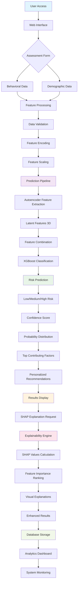
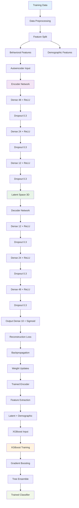
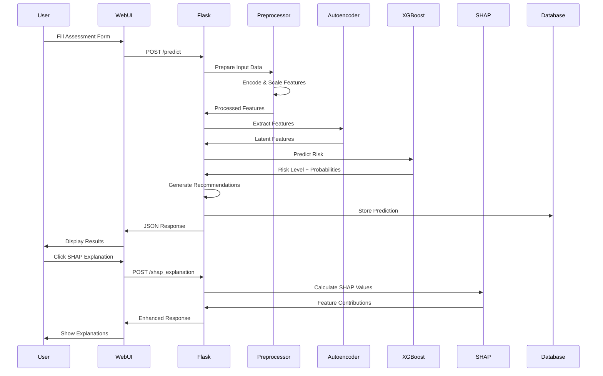
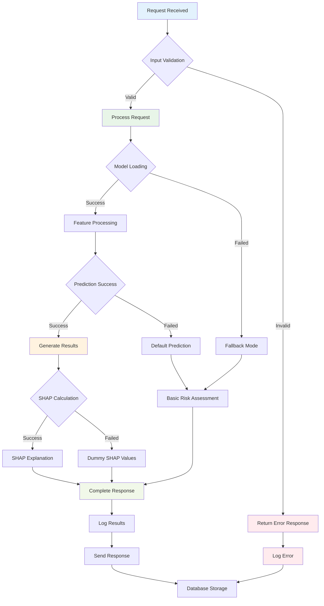
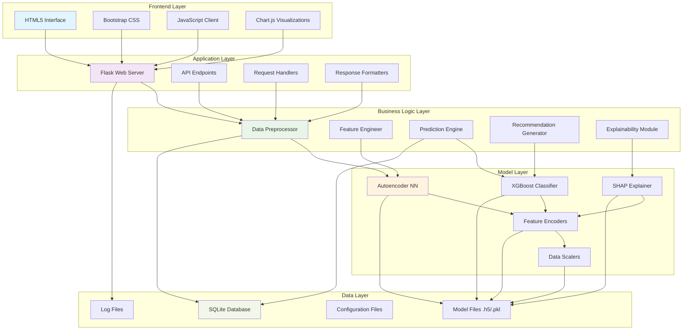

# Mental Health Vulnerability Prediction System - Flowchart

## System Architecture Flowchart

## Data Processing Flowchart

```mermaid
graph LR
    A[Raw CSV Data] --> B[Data Loading]
    B --> C[Format Detection]
    C --> D[Column Validation]
    D --> E[Missing Value Handling]
    E --> F[Feature Engineering]
    
    F --> G[Behavioral Features]
    F --> H[Demographic Features]
    
    G --> I[Label Encoding]
    H --> J[Standard Scaling]
    
    I --> K[Train/Test Split]
    J --> K
    K --> L[Model Training]
    
    L --> M[Autoencoder Training]
    L --> N[XGBoost Training]
    
    M --> O[Latent Feature Extraction]
    N --> P[Combined Features]
    O --> P
    P --> Q[Model Evaluation]
    Q --> R[Model Deployment]
    
    style A fill:#ffebee
    style F fill:#e8f5e8
    style L fill:#e3f2fd
    style Q fill:#fff3e0
    style R fill:#f1f8e9
```

## Model Training Flowchart

## Prediction Request Flowchart

## Error Handling Flowchart

## System Components Architecture

## Key Workflow Insights

### 1. **Data Flow Architecture**
- **Input**: User behavioral and demographic data
- **Processing**: Feature encoding, scaling, and validation
- **Prediction**: Hybrid model (Autoencoder + XGBoost)
- **Output**: Risk level, confidence, explanations, recommendations

### 2. **Model Integration Strategy**
- **Autoencoder**: Extracts latent behavioral patterns (10D → 3D)
- **XGBoost**: Classifies combined features (3D + 5D demographic)
- **SHAP**: Provides explainability for predictions

### 3. **Error Resilience**
- **Input Validation**: Prevents malformed data
- **Fallback Mechanisms**: Graceful degradation when models fail
- **Comprehensive Logging**: Tracks all operations for debugging

### 4. **User Experience Flow**
- **Simple Form**: Easy data entry
- **Instant Results**: Real-time prediction
- **Detailed Explanations**: SHAP-based feature importance
- **Actionable Insights**: Personalized recommendations

This flowchart represents a production-ready mental health prediction system with robust architecture, comprehensive error handling, and user-centric design.
